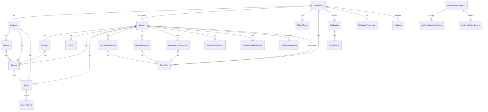

# Phase 3 Entity Relationships

## Full ER Diagram

## New Entities Summary

| Entity | Table | Package |
|--------|-------|---------|
| `StoredFile` | `stored_file` | `storage` |
| `WorkerPortfolioItem` | `worker_portfolio_item` | `portfolio` |
| `WorkerCertificate` | `worker_certificate` | `portfolio` |
| `WorkerIdentityDocument` | `worker_identity_document` | `portfolio` |
| `WorkerServiceArea` | `worker_service_area` | `search` |
| `Notification` | `notification` | `notification` |
| `NotificationPreference` | `notification_preference` | `notification` |
| `EmailOutbox` | `email_outbox` | `notification` |
| `AnalyticsDailySnapshot` | `analytics_daily_snapshot` | `analytics` |
| `AnalyticsCategoryRanking` | `analytics_category_ranking` | `analytics` |
| `AnalyticsWorkerRanking` | `analytics_worker_ranking` | `analytics` |
| `WorkerWorkingHours` | `worker_working_hours` | `availability` |
| `WorkerScheduleOverride` | `worker_schedule_override` | `availability` |
| `ReviewReport` | `review_report` | `review` |
| `AuditLog` | `audit_log` | `audit` |

## Extended Existing Entities

### Worker (new columns)

| Column | Type | Purpose |
|--------|------|---------|
| `primary_city` | VARCHAR(100) | Search by city |
| `primary_state` | VARCHAR(100) | State filter |
| `profile_photo_file_id` | UUID FK | Profile photo |
| `profile_completion_percent` | SMALLINT | Completion % |
| `online_status` | VARCHAR(20) | ONLINE / OFFLINE |
| `last_seen_at` | TIMESTAMP | Heartbeat |
| `vacation_mode` | BOOLEAN | Vacation flag |
| `vacation_start` | DATE | Vacation range |
| `vacation_end` | DATE | Vacation range |

### Review (new columns)

| Column | Type | Purpose |
|--------|------|---------|
| `moderation_status` | VARCHAR(20) | PENDING, APPROVED, REJECTED, HIDDEN |
| `moderated_by` | UUID FK | Admin user |
| `moderated_at` | TIMESTAMP | Moderation time |
| `moderation_notes` | VARCHAR(500) | Admin notes |

## Phase 1–2 Entities (unchanged)

All extend `BaseEntity` with `UUID id`, `Instant createdAt`, `Instant updatedAt`.
